# 网络信息安全密码算法编程实验报告

<style>
html,
body,
#write,
.markdown-body {
  font-family: "Times New Roman", "FangSong", "仿宋", "STFangsong", serif !important;
  font-size: 12pt !important;
  line-height: 1.6 !important;
}

p,
#write p,
.markdown-body p {
  font-family: "Times New Roman", "FangSong", "仿宋", "STFangsong", serif !important;
  text-indent: 2em !important;
}

h1,
h2,
h3,
h4,
h5,
h6,
li,
blockquote,
table,
th,
td,
pre,
code,
div,
#write h1,
#write h2,
#write h3,
#write h4,
#write h5,
#write h6,
#write li,
#write blockquote,
#write table,
#write th,
#write td,
#write pre,
#write code,
#write div,
.markdown-body h1,
.markdown-body h2,
.markdown-body h3,
.markdown-body h4,
.markdown-body h5,
.markdown-body h6,
.markdown-body li,
.markdown-body blockquote,
.markdown-body table,
.markdown-body th,
.markdown-body td,
.markdown-body pre,
.markdown-body code,
.markdown-body div {
  text-indent: 0 !important;
}

code,
pre,
pre code {
  font-family: Consolas, "Times New Roman", monospace !important;
}
</style>
**实现语言**：Python、HTML、CSS、JavaScript  
**项目目录**：`Password_algorithm`  
**GitHub 仓库**：<https://github.com/Happyhppay/Password_algorithm>  

<div style="page-break-after: always;"></div>

## 摘要

本实验完成了密码算法的程序设计、代码开发、可视化展示与接口调用实现。实验覆盖对称加密算法 AES、SM4、RC6，哈希算法 SHA1、SHA256、SHA3、RIPEMD160，消息认证与密钥派生算法 HMAC-SHA1、HMAC-SHA256、PBKDF2，编码算法 Base64、UTF-8，以及公钥密码算法 RSA-1024、ECC-160、RSA-SHA1、ECDSA。

系统采用模块化设计，将不同类型的密码算法拆分到独立 Python 模块中，并通过统一接口 `call_algorithm` 对外提供算法调用能力。为了满足“输入输出及执行过程可见、可测”的要求，项目提供命令行工具、自检脚本和 Web 前端展示页面。命令行工具用于快速验证算法输入输出，测试脚本用于自动执行核心测试向量和往返测试，Web 前端用于图形化选择算法、填写参数并查看统一 JSON 返回结果。

本报告围绕系统设计、算法实现、执行结果、接口调用和参考文献展开，说明各算法的实现思路、项目结构、关键函数、测试方法和运行结果。

**关键词**：AES；SM4；RC6；SHA256；PBKDF2；RSA；ECC；ECDSA；密码算法；接口调用

<div style="page-break-after: always;"></div>

## 目录

1. 实验概述
2. 系统设计
3. 开发环境与项目结构
4. 对称加密算法实现
5. 哈希、HMAC 与 PBKDF2 实现
6. 编码算法实现
7. 公钥密码算法实现
8. 统一接口与命令行调用
9. Web 前端展示设计
10. 执行结果与测试
11. 接口调用测试
12. 实验总结
13. 参考文献

<div style="page-break-after: always;"></div>

## 1. 实验概述

### 1.1 实验背景

密码算法是网络信息安全体系中的核心技术，广泛应用于数据加密、身份认证、完整性校验、数字签名、密钥交换和安全协议构建等场景。对称加密算法通常用于大批量数据加密，具有速度快、实现效率高等特点；哈希算法用于生成定长摘要，常用于完整性校验和签名预处理；HMAC 和 PBKDF2 分别用于消息认证和口令密钥派生；公钥密码算法则用于密钥分发、数字签名和身份认证。

本实验编程实现指定密码算法，并提供可见、可测、可接口调用的演示系统。实验过程中重点关注分组密码结构、哈希接口、消息认证码、公钥加密、椭圆曲线运算和数字签名流程。

### 1.2 实验目标

本实验主要目标如下：

1. 编程实现 AES、SM4、RC6 三类对称加密算法。
2. 编程实现 SHA1、SHA256、SHA3、RIPEMD160 等哈希算法。
3. 实现 HMAC-SHA1、HMAC-SHA256 与 PBKDF2 密钥派生功能。
4. 实现 Base64 与 UTF-8 编码转换功能。
5. 实现 RSA-1024、RSA-SHA1、ECC-160、ECDSA 等公钥密码功能。
6. 设计统一接口，支持第三方程序通过接口传参并获得状态码与结果。
7. 提供命令行、测试脚本和 Web 前端，使输入输出与执行过程可见、可测。

### 1.3 作业要求对应关系

| 作业要求 | 本项目实现方式 |
| --- | --- |
| 对称加密算法 AES、SM4、RC6 | `crypto_lab/aes.py`、`crypto_lab/sm4.py`、`crypto_lab/rc6.py` |
| 哈希算法 SHA1、SHA256、SHA3、RIPEMD160 | `crypto_lab/hash_codecs.py` |
| HMAC-SHA1、HMAC-SHA256、PBKDF2 | `crypto_lab/hash_codecs.py` |
| Base64、UTF-8 编码 | `crypto_lab/hash_codecs.py` |
| RSA-1024bit、ECC-160bit、RSA-SHA1、ECDSA | `crypto_lab/rsa.py`、`crypto_lab/ecc.py` |
| 输入输出及执行过程可见、可测 | `tests.py`、`crypto_cli.py`、Web 前端 |
| 支持第三方接口调用并返回状态码 | `crypto_lab/api.py` 中的 `call_algorithm` |


<div style="page-break-after: always;"></div>

## 2. 系统设计

### 2.1 总体设计思路

本项目采用分层和模块化设计。底层为各类密码算法实现模块，中间层为统一接口封装，外层为命令行工具、测试脚本和 Web 前端展示。不同算法模块之间保持较低耦合，统一接口模块负责处理算法选择、参数转换、状态码返回和异常捕获。

系统分为以下四层：

1. **算法实现层**：实现 AES、SM4、RC6、RSA、ECC 等核心算法，并封装哈希、HMAC、PBKDF2、Base64、UTF-8。
2. **公共工具层**：提供字节转换、十六进制转换、Base64 转换、PKCS#7 填充、模逆、素数生成等通用函数。
3. **接口服务层**：通过 `call_algorithm` 函数统一接收算法名、操作名和参数字典，返回统一结构。
4. **展示与测试层**：通过 CLI、测试脚本和 Web 页面展示算法调用过程与执行结果。

### 2.2 系统架构图

```text
+-----------------------+
|       Web 前端         |
| index.html/app.js     |
+-----------+-----------+
            |
            | HTTP POST /api/call
            v
+-----------------------+
|     web_server.py      |
| 静态页面 + API 转发    |
+-----------+-----------+
            |
            | Python 函数调用
            v
+-----------------------+
| crypto_lab/api.py      |
| call_algorithm 统一接口 |
+-----------+-----------+
            |
            v
+-----------------------+
|  各密码算法实现模块     |
| AES/SM4/RC6/RSA/ECC... |
+-----------------------+
```

### 2.3 模块划分

| 模块 | 主要职责 |
| --- | --- |
| `crypto_lab/aes.py` | AES-128 分组加密、解密、ECB/CBC 模式 |
| `crypto_lab/sm4.py` | SM4 分组加密、解密、ECB/CBC 模式 |
| `crypto_lab/rc6.py` | RC6-32/20/16 加密、解密、ECB/CBC 模式 |
| `crypto_lab/hash_codecs.py` | 哈希、HMAC、PBKDF2、Base64、UTF-8 |
| `crypto_lab/rsa.py` | RSA 密钥生成、加解密、RSA-SHA1 签名验签 |
| `crypto_lab/ecc.py` | secp160r1 椭圆曲线、ECDSA、ECDH |
| `crypto_lab/utils.py` | 字节转换、填充、数论工具、素数生成 |
| `crypto_lab/api.py` | 统一算法接口与状态码 |
| `crypto_cli.py` | 命令行调用入口 |
| `web_server.py` | 本地 Web 服务与接口转发 |
| `web/` | 前端页面、样式和交互脚本 |
| `tests.py` | 自动化测试与结果展示 |

### 2.4 数据流设计

统一接口的数据流如下：

1. 用户从 CLI、Web 页面或第三方程序输入算法名、操作名和参数。
2. 接口层读取参数中的 `data_format`、`key_format`、`iv_format` 等字段，将文本、十六进制或 Base64 输入转换为字节。
3. 接口层根据算法名分发到对应模块，例如 AES 分发到 `crypto_lab/aes.py`。
4. 算法模块完成加密、解密、摘要、签名或验签。
5. 接口层根据 `output_format` 将输出转换为十六进制、Base64 或文本。
6. 最终返回统一 JSON 风格结果，包括 `status`、`message` 和 `result`。

### 2.5 状态码设计

本项目采用简单明确的状态码：

| 状态码 | 含义 |
| --- | --- |
| `0` | 执行成功 |
| `1` | 执行失败，例如参数错误、算法不支持、输入格式错误或验算异常 |

统一返回格式如下：

```json
{
  "status": 0,
  "message": "ok",
  "result": "算法执行结果"
}
```

### 2.6 项目总体结构截图

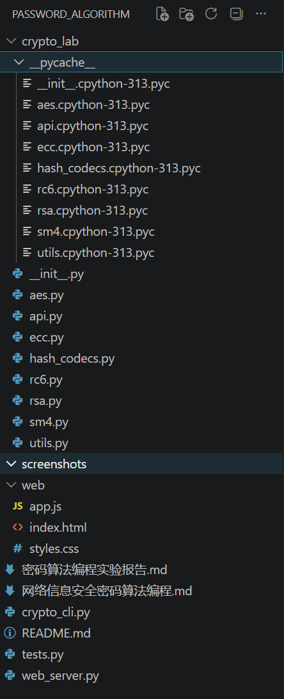

<div align="center">图 2-1 项目目录结构</div>

<div style="page-break-after: always;"></div>

## 3. 开发环境与项目结构

### 3.1 开发环境

| 项目 | 内容 |
| --- | --- |
| 操作系统 | Windows |
| 主要语言 | Python 3 |
| 前端技术 | HTML、CSS、JavaScript |
| 后端服务 | Python 标准库 `http.server` |
| 外部依赖 | 无需额外安装第三方库 |
| 运行方式 | 命令行、自检脚本、本地 Web 页面 |

本项目未依赖外部密码库实现核心密码算法。AES、SM4、RC6、SHA1、SHA256、SHA3-256、RIPEMD160、HMAC、PBKDF2、RSA、ECC、RSA-SHA1 和 ECDSA 均在项目源码中实现。Web 服务、命令行参数解析等非密码算法部分使用 Python 标准库完成。

### 3.2 项目文件结构

```text
Password_algorithm/
  网络信息安全密码算法编程.md
  README.md
  tests.py
  crypto_cli.py
  web_server.py
  crypto_lab/
    __init__.py
    api.py
    utils.py
    aes.py
    sm4.py
    rc6.py
    hash_codecs.py
    rsa.py
    ecc.py
  web/
    index.html
    styles.css
    app.js
```

### 3.3 运行方式

执行自动化自检：

```powershell
python tests.py
```

执行命令行调用：

```powershell
python crypto_cli.py SHA256 digest --data abc
```

启动 Web 前端：

```powershell
python web_server.py --port 8000
```

浏览器访问：

```text
http://127.0.0.1:8000
```

### 3.4 开发环境与运行命令截图

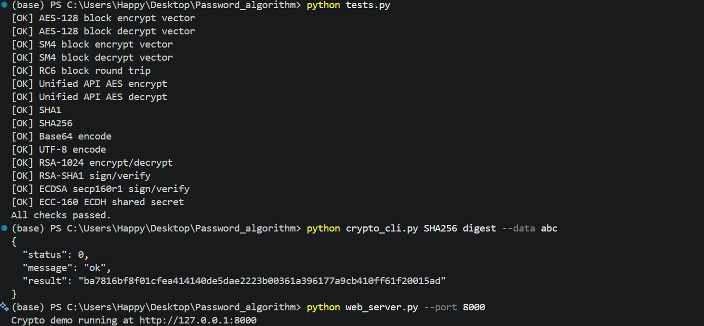

<div align="center">图 3-1 开发环境与运行命令</div>

<div style="page-break-after: always;"></div>

## 4. 对称加密算法实现

### 4.1 对称加密模块概述

对称加密算法使用同一个密钥完成加密和解密。本实验实现 AES、SM4、RC6 三种分组密码。三种算法的分组长度均为 128 bit，即 16 字节。为了便于处理任意长度输入，项目在分组加密基础上实现了 ECB 和 CBC 两种工作模式，并使用 PKCS#7 填充处理最后一个不满分组的数据块。

对称加密模块的共同特征如下：

1. 提供 `encrypt_block` 与 `decrypt_block`，用于单个 16 字节分组加解密。
2. 提供 `encrypt` 与 `decrypt`，用于任意长度数据加解密。
3. 支持 `ECB` 与 `CBC` 模式。
4. 默认 CBC 模式下如果未传入 IV，则使用全零 IV，便于重复测试。
5. 统一通过 `crypto_lab/api.py` 暴露给 CLI、Web 和第三方程序。

### 4.2 PKCS#7 填充

由于分组密码一次处理固定长度分组，当明文长度不是分组长度整数倍时，需要填充。本项目使用 PKCS#7 填充方案。若分组大小为 16 字节，缺少 `n` 个字节，则填充 `n` 个值为 `n` 的字节；如果明文长度刚好是分组大小整数倍，则额外补充一个完整分组。

相关函数位于 `crypto_lab/utils.py`：

```python
def pkcs7_pad(data: bytes, block_size: int) -> bytes:
    pad_len = block_size - (len(data) % block_size)
    return data + bytes([pad_len] * pad_len)

def pkcs7_unpad(data: bytes, block_size: int) -> bytes:
    pad_len = data[-1]
    if data[-pad_len:] != bytes([pad_len] * pad_len):
        raise ValueError("invalid PKCS#7 padding")
    return data[:-pad_len]
```

填充机制使 AES、SM4、RC6 都可以处理中文字符串、英文文本和任意二进制数据。

### 4.3 AES 算法实现

AES 是目前应用广泛的分组密码标准。本项目实现 AES-128，即密钥长度为 128 bit，分组长度为 128 bit，轮数为 10 轮。AES 加密过程主要包含轮密钥加、字节代换、行移位、列混合等步骤。

AES 模块位于 `crypto_lab/aes.py`，核心内容包括：

| 函数 | 功能 |
| --- | --- |
| `_key_expansion` | 生成 AES-128 轮密钥 |
| `_sub_bytes` | S 盒字节代换 |
| `_shift_rows` | 行移位 |
| `_mix_columns` | 列混合 |
| `encrypt_block` | 单分组加密 |
| `decrypt_block` | 单分组解密 |
| `encrypt` | 多分组加密，支持 ECB/CBC |
| `decrypt` | 多分组解密，支持 ECB/CBC |

AES-128 单分组加密流程如下：

```text
输入明文分组和 128 bit 密钥
    |
密钥扩展，生成 11 组轮密钥
    |
初始 AddRoundKey
    |
执行 9 轮 SubBytes、ShiftRows、MixColumns、AddRoundKey
    |
执行最后一轮 SubBytes、ShiftRows、AddRoundKey
    |
输出密文分组
```

本项目使用 AES 标准测试向量进行验证：

| 项目 | 十六进制值 |
| --- | --- |
| 密钥 | `000102030405060708090a0b0c0d0e0f` |
| 明文 | `00112233445566778899aabbccddeeff` |
| 期望密文 | `69c4e0d86a7b0430d8cdb78070b4c55a` |

测试脚本中对应检查项：

```python
check(aes.encrypt_block(aes_plain, aes_key) == aes_cipher, "AES-128 block encrypt vector")
check(aes.decrypt_block(aes_cipher, aes_key) == aes_plain, "AES-128 block decrypt vector")
```

### 4.4 SM4 算法实现

SM4 是我国商用密码分组密码算法，分组长度和密钥长度均为 128 bit。SM4 采用 32 轮非线性迭代结构，包含固定参数 FK、CK、S 盒替换以及线性变换。

SM4 模块位于 `crypto_lab/sm4.py`，主要函数如下：

| 函数 | 功能 |
| --- | --- |
| `round_keys` | 根据 128 bit 主密钥生成 32 个轮密钥 |
| `_tau` | S 盒非线性代换 |
| `_l_trans` | 加密轮函数线性变换 |
| `_l_key` | 密钥扩展线性变换 |
| `encrypt_block` | SM4 单分组加密 |
| `decrypt_block` | SM4 单分组解密 |
| `encrypt` | SM4 多分组加密 |
| `decrypt` | SM4 多分组解密 |

SM4 加密过程使用 32 轮迭代：

```text
X[i+4] = X[i] xor T(X[i+1] xor X[i+2] xor X[i+3] xor rk[i])
```

解密时轮密钥顺序与加密相反，因此同一轮函数可用于加密和解密。

本项目使用 SM4 标准测试向量验证：

| 项目 | 十六进制值 |
| --- | --- |
| 密钥 | `0123456789abcdeffedcba9876543210` |
| 明文 | `0123456789abcdeffedcba9876543210` |
| 期望密文 | `681edf34d206965e86b3e94f536e4246` |

测试脚本中对应检查项：

```python
check(sm4.encrypt_block(sm4_plain, sm4_key) == sm4_cipher, "SM4 block encrypt vector")
check(sm4.decrypt_block(sm4_cipher, sm4_key) == sm4_plain, "SM4 block decrypt vector")
```

### 4.5 RC6 算法实现

RC6 是从 RC5 发展而来的分组密码算法，支持可变密钥长度。本项目实现 RC6-32/20/16，即字长为 32 bit，轮数为 20 轮，分组长度为 128 bit。RC6 使用整数加法、异或、乘法和循环移位构成轮函数。

RC6 模块位于 `crypto_lab/rc6.py`，主要函数如下：

| 函数 | 功能 |
| --- | --- |
| `key_schedule` | RC6 密钥扩展 |
| `_rotl` | 32 bit 左循环移位 |
| `_rotr` | 32 bit 右循环移位 |
| `encrypt_block` | 单分组加密 |
| `decrypt_block` | 单分组解密 |
| `encrypt` | 多分组加密 |
| `decrypt` | 多分组解密 |

RC6 加密过程将 128 bit 分组拆分为四个 32 bit 字：

```text
A, B, C, D = 明文分组拆分结果
B = B + S[0]
D = D + S[1]
for i in 1..20:
    t = (B * (2B + 1)) <<< 5
    u = (D * (2D + 1)) <<< 5
    A = ((A xor t) <<< u) + S[2i]
    C = ((C xor u) <<< t) + S[2i + 1]
    A, B, C, D = B, C, D, A
A = A + S[42]
C = C + S[43]
```

RC6 测试采用加密后再解密的往返验证方式，确保解密结果与原始明文一致：

```python
rc6_cipher = rc6.encrypt_block(rc6_plain, rc6_key)
check(rc6.decrypt_block(rc6_cipher, rc6_key) == rc6_plain, "RC6 block round trip")
```

### 4.6 CBC 模式实现

CBC 模式通过引入 IV 和前一密文分组，使相同明文分组在不同位置产生不同密文。CBC 加密过程如下：

```text
C[0] = Encrypt(P[0] xor IV)
C[i] = Encrypt(P[i] xor C[i-1])
```

CBC 解密过程如下：

```text
P[0] = Decrypt(C[0]) xor IV
P[i] = Decrypt(C[i]) xor C[i-1]
```

项目中 AES、SM4、RC6 均实现了相同的 CBC 调用逻辑，保证对称加密算法在接口层使用方式一致。

### 4.7 对称加密接口示例

通过统一接口调用 AES 加密：

```python
from crypto_lab.api import call_algorithm

resp = call_algorithm(
    "AES",
    "encrypt",
    {
        "data": "北邮信息安全",
        "key": "00112233445566778899aabbccddeeff",
        "key_format": "hex",
        "output_format": "hex"
    }
)
print(resp)
```

返回结果示例：

```json
{
  "status": 0,
  "message": "ok",
  "result": "ee4d6eeb82ab47d76be94633d5b4f944478fdcc3ecc56b6aadca1d38d8206735"
}
```

### 4.8 对称加密执行结果截图

以下截图展示 AES、SM4、RC6 在前端中的加密、解密、块加密、块解密执行结果。

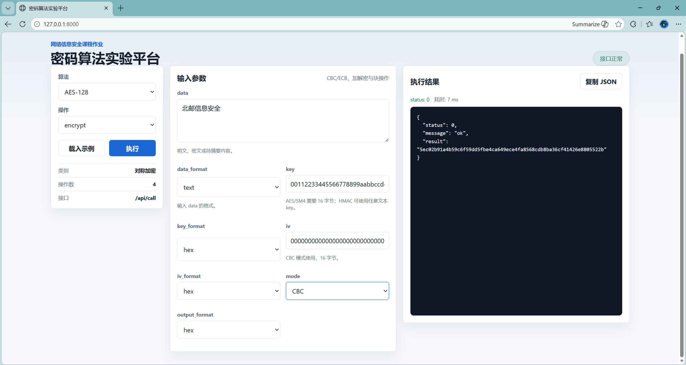

<div align="center">图 4-1 AES-128 CBC 加密结果</div>

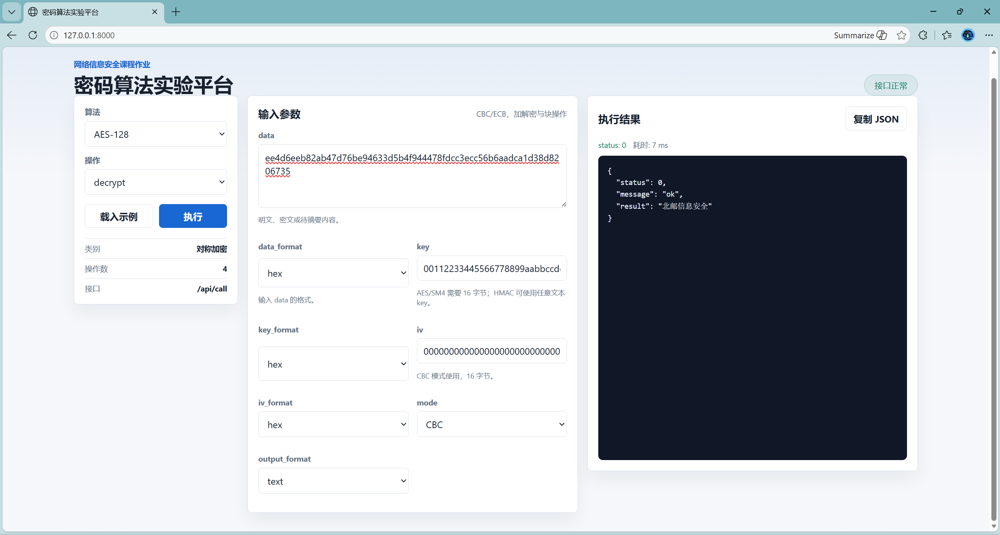

<div align="center">图 4-2 AES-128 CBC 解密结果</div>


<div align="center">图 4-3 AES-128 ECB 加密结果</div>


<div align="center">图 4-4 AES-128 ECB 解密结果</div>

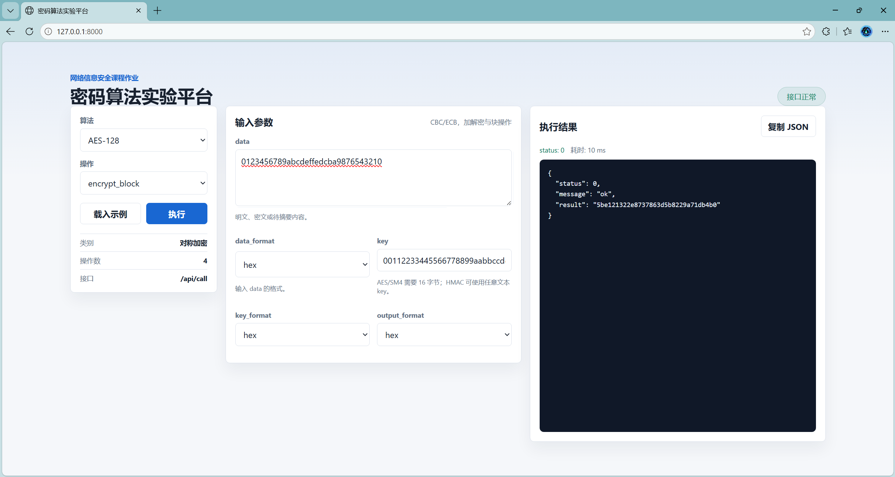

<div align="center">图 4-5 AES-128 块加密结果</div>

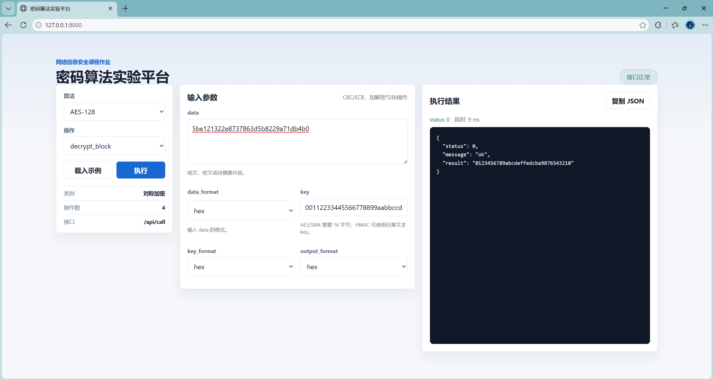

<div align="center">图 4-6 AES-128 块解密结果</div>

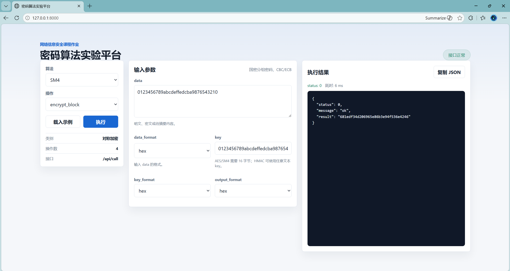

<div align="center">图 4-7 SM4 块加密结果</div>

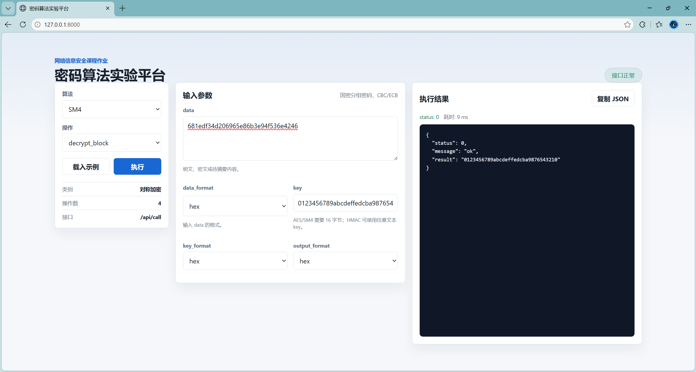

<div align="center">图 4-8 SM4 块解密结果</div>


<div align="center">图 4-9 SM4 CBC 加密结果</div>


<div align="center">图 4-10 SM4 CBC 解密结果</div>


<div align="center">图 4-11 SM4 ECB 加密结果</div>

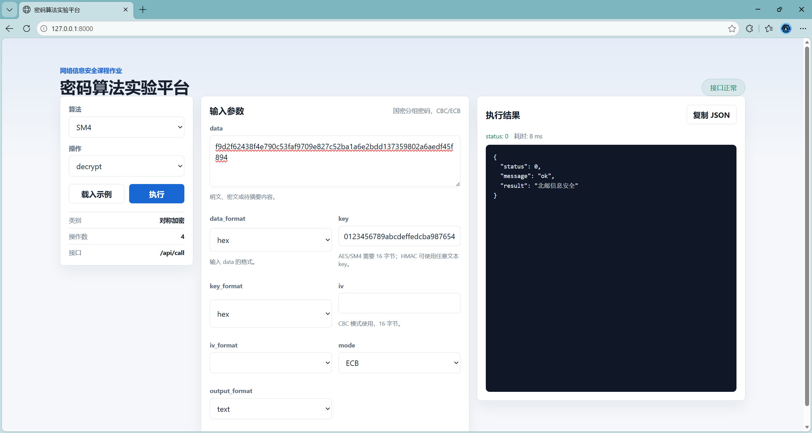

<div align="center">图 4-12 SM4 ECB 解密结果</div>

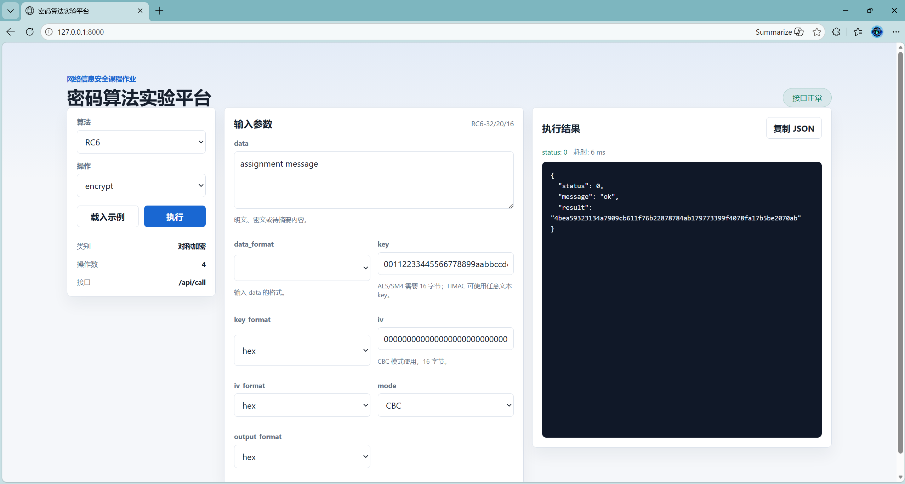

<div align="center">图 4-13 RC6 CBC 加密结果</div>


<div align="center">图 4-14 RC6 CBC 解密结果</div>

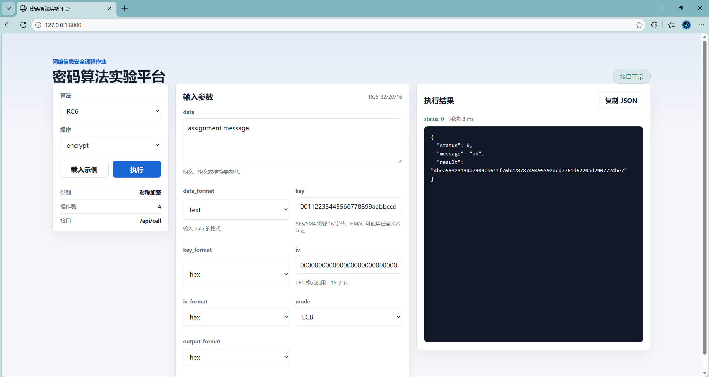

<div align="center">图 4-15 RC6 ECB 加密结果</div>

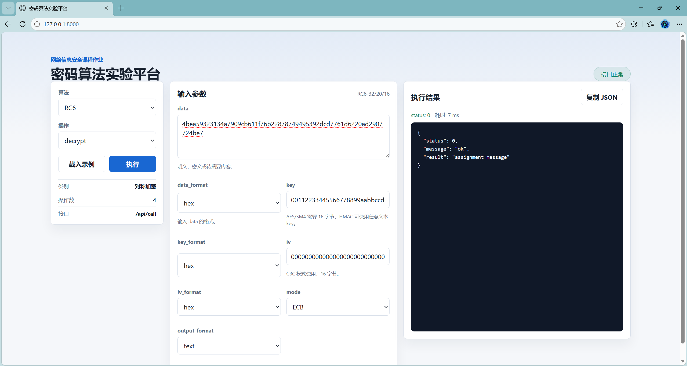

<div align="center">图 4-16 RC6 ECB 解密结果</div>


<div align="center">图 4-17 RC6 块加密结果</div>


<div align="center">图 4-18 RC6 块解密结果</div>

<div style="page-break-after: always;"></div>

## 5. 哈希、HMAC 与 PBKDF2 实现

### 5.1 摘要算法概述

哈希算法可以将任意长度输入映射为固定长度摘要，常用于数据完整性校验、数字签名预处理、口令存储和文件指纹计算。安全哈希算法应具有单向性、抗第二原像性和抗碰撞性。

本实验实现或封装以下哈希相关算法：

| 算法 | 输出长度 | 项目实现方式 |
| --- | --- | --- |
| SHA1 | 160 bit | 手写压缩函数与填充流程 |
| SHA256 | 256 bit | 手写消息扩展与 64 轮压缩流程 |
| SHA3-256 | 256 bit | 手写 Keccak-f[1600] 置换与海绵结构 |
| RIPEMD160 | 160 bit | 手写双线并行压缩流程 |
| HMAC-SHA1 | 160 bit | 基于手写 SHA1 实现 |
| HMAC-SHA256 | 256 bit | 基于手写 SHA256 实现 |
| PBKDF2 | 可配置 | 基于手写 HMAC 实现 |

相关代码位于 `crypto_lab/hash_codecs.py`。摘要类函数统一接收字节输入，返回字节或十六进制字符串，便于接口层统一展示。

### 5.2 SHA1 实现说明

SHA1 输出 160 bit 摘要，曾广泛用于数字签名和完整性校验。本项目中 SHA1 主要用于课程要求中的摘要演示，同时 RSA-SHA1 签名也使用 SHA1 摘要。

接口调用示例：

```python
call_algorithm("SHA1", "digest", {"data": "abc"})
```

期望输出：

```text
a9993e364706816aba3e25717850c26c9cd0d89d
```

测试脚本检查：

```python
check(call_algorithm("SHA1", "digest", {"data": "abc"})["result"] == "a9993e364706816aba3e25717850c26c9cd0d89d", "SHA1")
```

### 5.3 SHA256 实现说明

SHA256 属于 SHA-2 系列，输出 256 bit 摘要，安全性和使用范围优于 SHA1。本项目手写实现消息填充、消息扩展、布尔函数、轮常量和 64 轮压缩过程，并可通过统一接口和命令行直接调用。

命令行示例：

```powershell
python crypto_cli.py SHA256 digest --data abc
```

返回结果：

```json
{
  "status": 0,
  "message": "ok",
  "result": "ba7816bf8f01cfea414140de5dae2223b00361a396177a9cb410ff61f20015ad"
}
```

### 5.4 SHA3 实现说明

SHA3 是基于 Keccak 海绵结构的哈希算法，与 SHA-2 内部结构不同。项目中将 `SHA3` 映射为 `SHA3-256`，输出 256 bit 摘要。

核心调用片段如下：

```python
if name in {"sha3", "sha3256"}:
    return sha3_256(data)
```

统一接口调用：

```python
call_algorithm("SHA3", "digest", {"data": "abc"})
```

### 5.5 RIPEMD160 实现说明

RIPEMD160 输出 160 bit 摘要，常见于部分数字货币地址生成流程和历史安全系统中。本项目手写实现左右两条并行压缩线、消息字顺序、循环移位参数和五个状态字更新。

核心调用片段如下：

```python
if name == "ripemd160":
    return ripemd160(data)
```

统一接口调用：

```python
call_algorithm("RIPEMD160", "digest", {"data": "abc"})
```

### 5.6 HMAC-SHA1 与 HMAC-SHA256

HMAC 是基于密钥的消息认证码，可用于验证消息完整性和来源真实性。与普通哈希不同，HMAC 需要共享密钥，攻击者即使知道消息内容，也难以在不知道密钥的情况下生成有效认证码。

本项目支持：

1. HMAC-SHA1
2. HMAC-SHA256

实现片段如下：

```python
def hmac_digest(data: bytes, key: bytes, algorithm: str) -> bytes:
    ipad = bytes(x ^ 0x36 for x in key)
    opad = bytes(x ^ 0x5C for x in key)
    return digest(opad + digest(ipad + data, hash_name), hash_name)
```

接口调用示例：

```python
call_algorithm(
    "HmacSHA256",
    "digest",
    {
        "data": "abc",
        "key": "secret"
    }
)
```

HMAC 输出为十六进制字符串，适合直接在终端和报告中展示。

### 5.7 PBKDF2 实现说明

PBKDF2 是基于口令的密钥派生函数，通过盐值和多轮迭代增加暴力破解成本。其常用于从用户口令派生加密密钥或口令存储校验值。

本项目支持以下参数：

| 参数 | 含义 |
| --- | --- |
| `password` | 输入口令 |
| `salt` | 盐值 |
| `iterations` | 迭代次数 |
| `dklen` | 派生密钥长度 |
| `hash` | 底层哈希算法，如 `sha256` |

实现片段如下：

```python
def pbkdf2(password: bytes, salt: bytes, iterations: int = 100_000, dklen: int = 32, algorithm: str = "sha256") -> bytes:
    u = hmac_digest(salt + block_index.to_bytes(4, "big"), password, f"hmac{name}")
    ...
```

接口调用示例：

```python
call_algorithm(
    "PBKDF2",
    "derive",
    {
        "password": "password",
        "salt": "salt",
        "iterations": 1000,
        "dklen": 32,
        "hash": "sha256"
    }
)
```

### 5.8 哈希与认证算法截图

以下截图展示 SHA1、SHA256、SHA3-256、RIPEMD160、HMAC 和 PBKDF2 的执行结果。


<div align="center">图 5-1 SHA1 摘要结果</div>

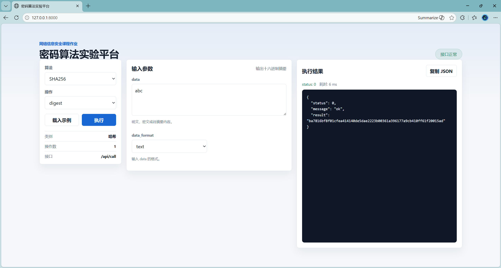

<div align="center">图 5-2 SHA256 摘要结果</div>


<div align="center">图 5-3 SHA3-256 摘要结果</div>


<div align="center">图 5-4 RIPEMD160 摘要结果</div>


<div align="center">图 5-5 HMAC-SHA1 结果</div>

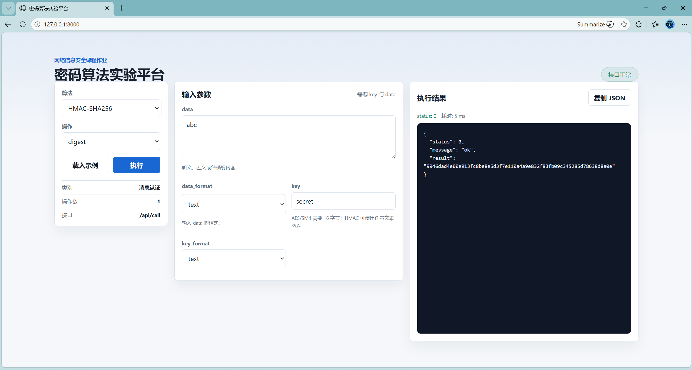

<div align="center">图 5-6 HMAC-SHA256 结果</div>

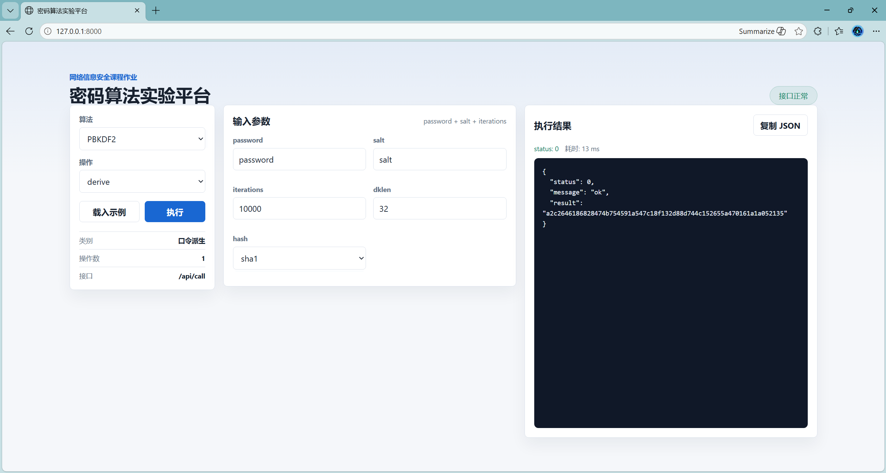

<div align="center">图 5-7 PBKDF2-SHA1 派生结果</div>


<div align="center">图 5-8 PBKDF2-SHA256 派生结果</div>

<div style="page-break-after: always;"></div>

## 6. 编码算法实现

### 6.1 编码算法概述

编码算法并不直接提供保密性，但在密码系统中非常常见。加密结果、摘要结果和签名结果通常是二进制数据，不适合直接在文本协议或网页中传输，因此需要使用 Base64 或十六进制等方式表示。UTF-8 则用于将中文、英文和符号等文本转换为字节序列，是密码算法处理文本输入前的重要步骤。

本项目实现以下编码功能：

| 编码 | 功能 |
| --- | --- |
| Base64 encode | 将字节编码为 Base64 文本 |
| Base64 decode | 将 Base64 文本恢复为字节 |
| UTF-8 encode | 将字符串编码为 UTF-8 字节，并以十六进制展示 |
| UTF-8 decode | 将 UTF-8 字节恢复为字符串 |

### 6.2 Base64 编码

Base64 将二进制数据映射为可打印字符，常用于密文、证书、密钥材料和网络传输内容的文本化展示。

实现片段如下：

```python
def base64_encode(data: bytes) -> str:
    value = int.from_bytes(block.ljust(3, b"\x00"), "big")
    ...

def base64_decode(text: str) -> bytes:
    value = (value << 6) | alphabet[ch]
    ...
```

测试脚本使用 `hello` 进行验证：

```python
check(call_algorithm("Base64", "encode", {"data": "hello"})["result"] == "aGVsbG8=", "Base64 encode")
```

### 6.3 UTF-8 编码

UTF-8 是互联网和现代操作系统广泛使用的字符编码方式。密码算法处理的是字节序列，因此用户输入的中文文本必须先编码为字节。

实现片段如下：

```python
def utf8_encode(text: str) -> bytes:
    return text.encode("utf-8")

def utf8_decode(data: bytes) -> str:
    return data.decode("utf-8")
```

测试脚本对中文“密码”进行 UTF-8 编码验证：

```python
check(call_algorithm("UTF-8", "encode", {"data": "密码"})["result"] == "e5af86e7a081", "UTF-8 encode")
```

### 6.4 输入输出格式处理

统一接口支持多种输入格式：

| 字段 | 说明 |
| --- | --- |
| `data_format = text` | 将输入视为普通文本 |
| `data_format = hex` | 将输入视为十六进制字符串 |
| `data_format = base64` | 将输入视为 Base64 字符串 |
| `output_format = text` | 输出 UTF-8 文本 |
| `output_format = hex` | 输出十六进制文本 |
| `output_format = base64` | 输出 Base64 文本 |

这样做的好处是同一套接口既能处理普通文本，也能处理密文、签名、密钥等二进制数据。

### 6.5 编码算法截图

以下截图展示 Base64 与 UTF-8 的编码、解码执行结果。


<div align="center">图 6-1 Base64 编码结果</div>

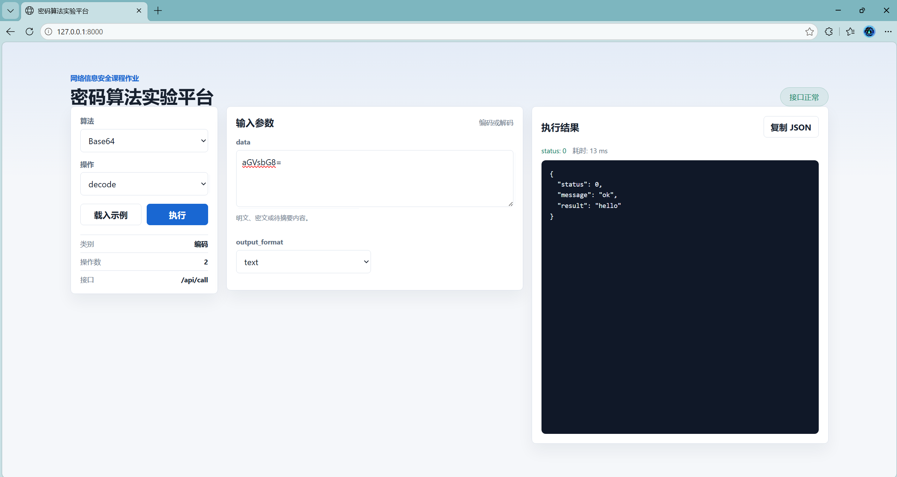

<div align="center">图 6-2 Base64 解码结果</div>

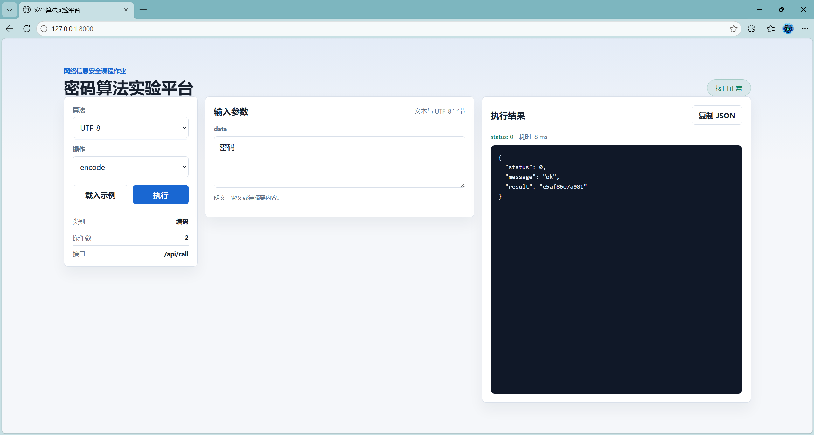

<div align="center">图 6-3 UTF-8 编码结果</div>

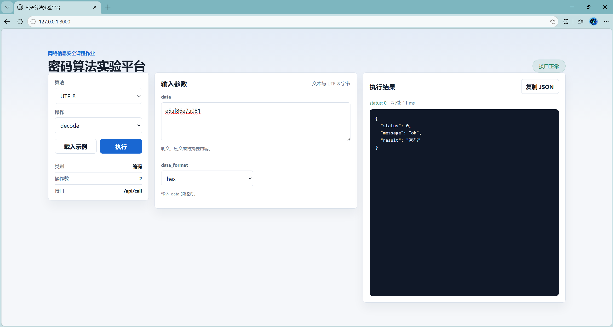

<div align="center">图 6-4 UTF-8 解码结果</div>

<div style="page-break-after: always;"></div>

## 7. 公钥密码算法实现

### 7.1 公钥密码模块概述

公钥密码算法使用一对数学相关的密钥：公钥可以公开，私钥必须保密。公钥密码可用于加密、数字签名、密钥交换和身份认证。本实验实现 RSA-1024、RSA-SHA1、ECC-160、ECDSA，并额外实现 ECDH 共享密钥功能，以便展示椭圆曲线公钥密码的常见应用。

公钥密码相关代码主要位于：

| 模块 | 功能 |
| --- | --- |
| `crypto_lab/rsa.py` | RSA 密钥生成、PKCS#1 v1.5 加解密、RSA-SHA1 签名验签 |
| `crypto_lab/ecc.py` | secp160r1 曲线点运算、密钥生成、ECDSA、ECDH |

### 7.2 RSA-1024 算法原理

RSA 的安全性基于大整数分解困难问题。RSA 密钥生成过程包括：

1. 随机生成两个大素数 `p` 和 `q`。
2. 计算模数 `n = p * q`。
3. 计算欧拉函数 `phi = (p - 1) * (q - 1)`。
4. 选择公钥指数 `e`，本项目使用常见值 `65537`。
5. 计算私钥指数 `d = e^-1 mod phi`。
6. 公钥为 `(n, e)`，私钥为 `(n, e, d, p, q)`。

本项目中 RSA 密钥生成函数如下：

```python
def generate_keypair(bits: int = 1024, e: int = 65537) -> RSAPrivateKey:
    p = generate_prime(half)
    q = generate_prime(bits - half)
    phi = (p - 1) * (q - 1)
    d = modinv(e, phi)
    return RSAPrivateKey(n=n, e=e, d=d, p=p, q=q)
```

素数生成使用 Miller-Rabin 概率素性测试，相关数论函数位于 `crypto_lab/utils.py`。

### 7.3 RSA 加密与解密

RSA 加密基本形式为：

```text
c = m^e mod n
```

RSA 解密基本形式为：

```text
m = c^d mod n
```

为了避免直接对短消息进行裸 RSA 加密，本项目实现了 PKCS#1 v1.5 风格的加密填充：

```text
EM = 0x00 || 0x02 || PS || 0x00 || M
```

其中 `PS` 为非零随机字节串。这样可以使同一明文每次加密得到不同密文，提高演示中的安全合理性。

RSA 加解密测试逻辑：

```python
rsa_key = rsa.generate_keypair(1024)
message = b"assignment message"
ciphertext = rsa.encrypt(message, rsa_key.public_key)
check(rsa.decrypt(ciphertext, rsa_key) == message, "RSA-1024 encrypt/decrypt")
```

### 7.4 RSA-SHA1 数字签名

数字签名用于验证消息来源和完整性。RSA-SHA1 签名流程如下：

1. 对消息计算 SHA1 摘要。
2. 将摘要封装为 DigestInfo 结构。
3. 使用 PKCS#1 v1.5 签名填充。
4. 使用私钥指数 `d` 计算签名。
5. 验签时使用公钥指数 `e` 恢复编码结果，并与本地计算结果比较。

项目中签名函数：

```python
def sign_sha1(message: bytes, private_key: RSAPrivateKey) -> bytes:
    digest_info = sha1_digest_info(sha1(message))
    encoded = b"\x00\x01" + padding + b"\x00" + digest_info
    sig = pow(bytes_to_int(encoded), private_key.d, private_key.n)
    return int_to_bytes(sig, k)
```

验签函数：

```python
def verify_sha1(message: bytes, signature: bytes, public_key: RSAPublicKey) -> bool:
    recovered = int_to_bytes(pow(bytes_to_int(signature), public_key.e, public_key.n), k)
    return recovered == expected
```

测试脚本中对应检查：

```python
signature = rsa.sign_sha1(message, rsa_key)
check(rsa.verify_sha1(message, signature, rsa_key.public_key), "RSA-SHA1 sign/verify")
```

### 7.5 ECC-160 曲线选择

ECC 即椭圆曲线密码算法，相比 RSA，ECC 在较短密钥长度下即可提供较高安全强度。本项目实现 ECC-160，曲线选择为 `secp160r1`。该曲线参数包括有限域素数 `P`、曲线参数 `A`、`B`、基点 `G`、阶 `N` 和余因子 `H`。

模块中定义如下：

```python
P = 0xFFFFFFFFFFFFFFFFFFFFFFFFFFFFFFFF7FFFFFFF
A = 0xFFFFFFFFFFFFFFFFFFFFFFFFFFFFFFFF7FFFFFFC
B = 0x1C97BEFC54BD7A8B65ACF89F81D4D4ADC565FA45
GX = 0x4A96B5688EF573284664698968C38BB913CBFC82
GY = 0x23A628553168947D59DCC912042351377AC5FB32
N = 0x0100000000000000000001F4C8F927AED3CA752257
```

椭圆曲线方程为：

```text
y^2 = x^3 + ax + b mod p
```

### 7.6 椭圆曲线点运算

ECC 的核心是点加和标量乘法。点加用于计算两个曲线点之和，标量乘法用于计算 `kG`，即基点 `G` 重复相加 `k` 次。

本项目实现了：

| 函数 | 功能 |
| --- | --- |
| `is_on_curve` | 判断点是否在曲线上 |
| `point_add` | 椭圆曲线点加 |
| `point_neg` | 求点的负元 |
| `scalar_mult` | 双倍-加法法实现标量乘 |

标量乘法是 ECC 密钥生成、ECDSA 和 ECDH 的基础。私钥为随机整数 `d`，公钥为：

```text
Q = dG
```

### 7.7 ECDSA 签名与验签

ECDSA 是基于椭圆曲线的数字签名算法。签名过程如下：

1. 选择私钥 `d`，计算公钥 `Q = dG`。
2. 对消息计算哈希摘要，并转换为整数 `z`。
3. 随机选择临时密钥 `k`。
4. 计算点 `(x1, y1) = kG`，令 `r = x1 mod n`。
5. 计算 `s = k^-1(z + rd) mod n`。
6. 签名结果为 `(r, s)`。

验签过程如下：

1. 检查 `r` 和 `s` 是否在合法范围内。
2. 计算 `w = s^-1 mod n`。
3. 计算 `u1 = zw mod n`，`u2 = rw mod n`。
4. 计算点 `X = u1G + u2Q`。
5. 若 `X.x mod n == r`，验签通过。

测试脚本中对应检查：

```python
ecc_key = ecc.generate_keypair()
sig = ecc.sign(message, ecc_key, "sha1")
check(ecc.verify(message, sig, ecc_key.public_key, "sha1"), "ECDSA secp160r1 sign/verify")
```

### 7.8 ECDH 共享密钥

ECDH 用于双方协商共享秘密。假设 Alice 私钥为 `a`，公钥为 `A = aG`；Bob 私钥为 `b`，公钥为 `B = bG`。双方分别计算：

```text
Alice: S = aB = abG
Bob:   S = bA = baG
```

由于椭圆曲线标量乘法满足交换意义下的等价结果，双方得到相同共享点。本项目返回共享点的 x 坐标作为共享秘密演示值。

测试脚本中对应检查：

```python
alice = ecc.generate_keypair()
bob = ecc.generate_keypair()
check(ecc.ecdh(alice, bob.public_key) == ecc.ecdh(bob, alice.public_key), "ECC-160 ECDH shared secret")
```

### 7.9 公钥算法接口示例

RSA 生成密钥：

```powershell
python crypto_cli.py RSA generate_keypair --bits 1024
```

ECDSA 生成密钥：

```powershell
python crypto_cli.py ECDSA generate_keypair
```

RSA-SHA1 签名可通过统一接口调用：

```python
call_algorithm(
    "RSA",
    "sign",
    {
        "data": "assignment message",
        "private_key": private_key,
        "output_format": "hex"
    }
)
```

ECDSA 签名返回格式为：

```json
{
  "r": "0x...",
  "s": "0x..."
}
```

### 7.10 公钥密码截图

以下截图展示 RSA-1024、RSA-SHA1、ECC-160 和 ECDSA 的密钥生成、加解密、签名验签和共享密钥结果。

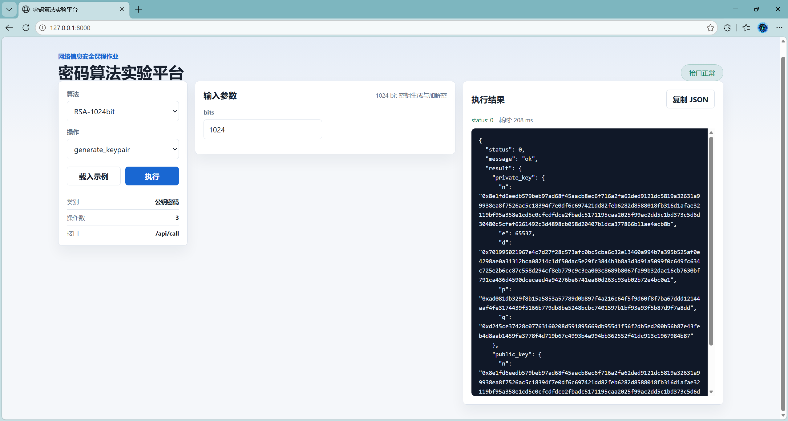

<div align="center">图 7-1 RSA-1024 密钥生成</div>

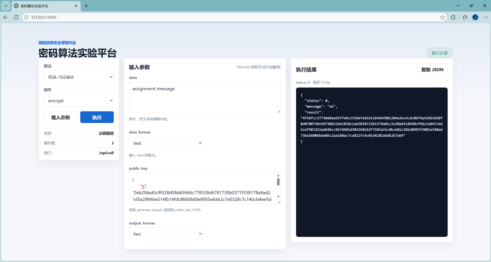

<div align="center">图 7-2 RSA-1024 加密结果</div>

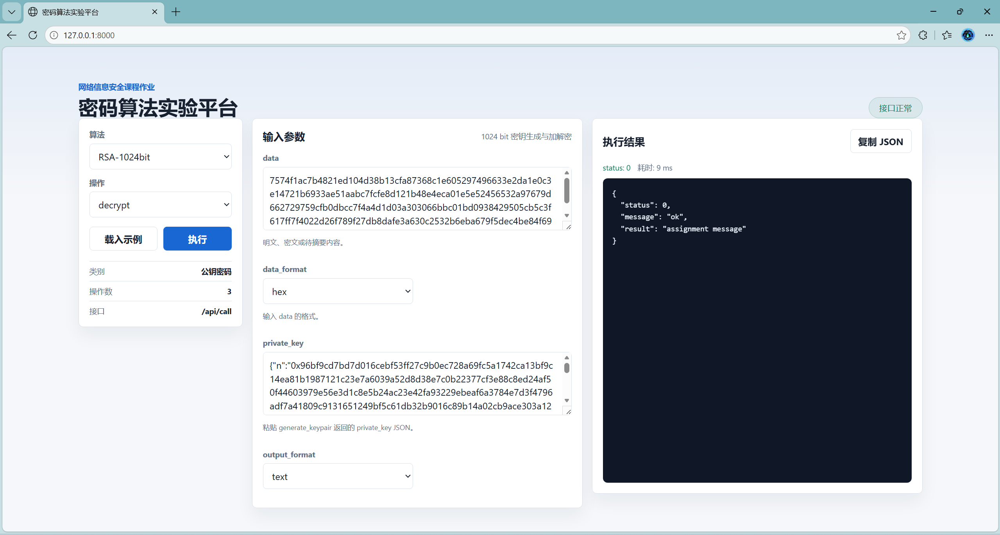

<div align="center">图 7-3 RSA-1024 解密结果</div>

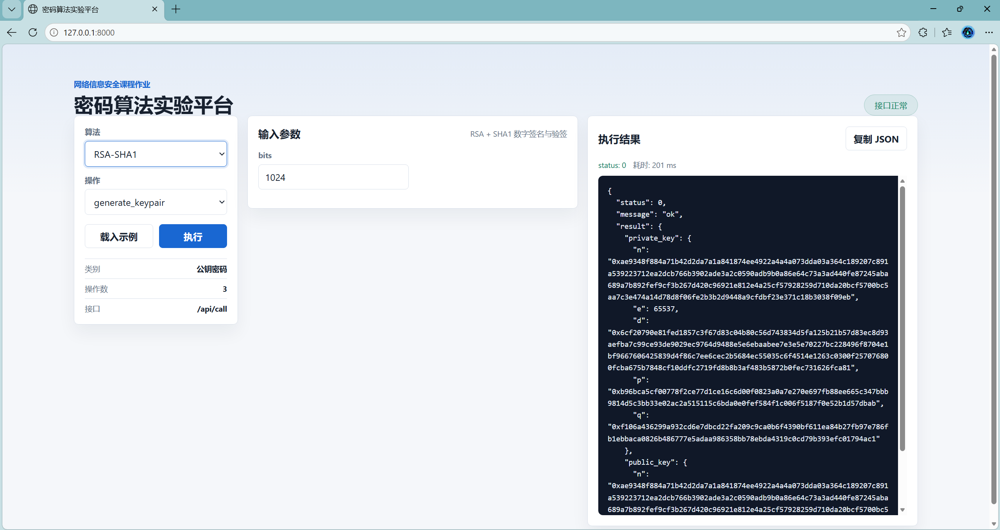

<div align="center">图 7-4 RSA-SHA1 密钥生成</div>

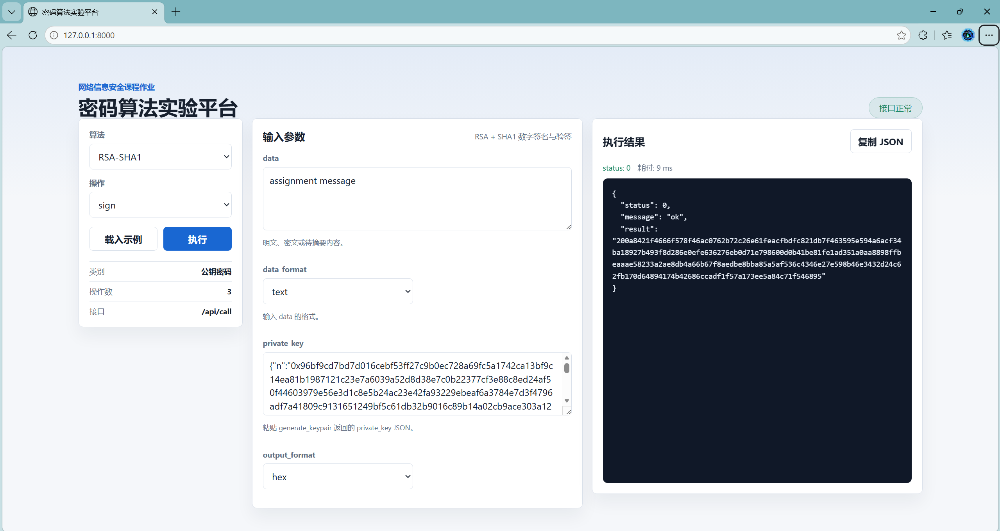

<div align="center">图 7-5 RSA-SHA1 签名结果</div>

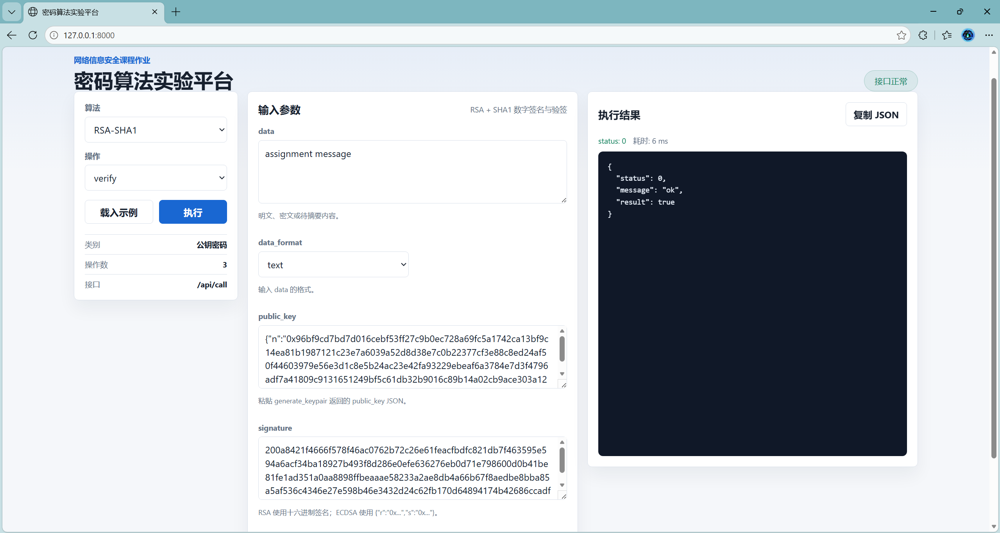

<div align="center">图 7-6 RSA-SHA1 验签结果</div>

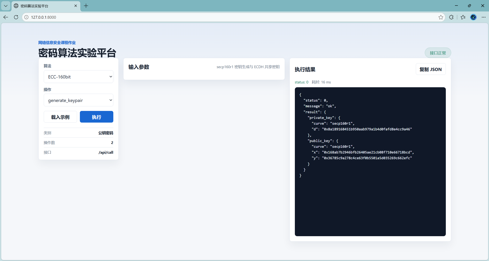

<div align="center">图 7-7 ECC-160 密钥生成</div>

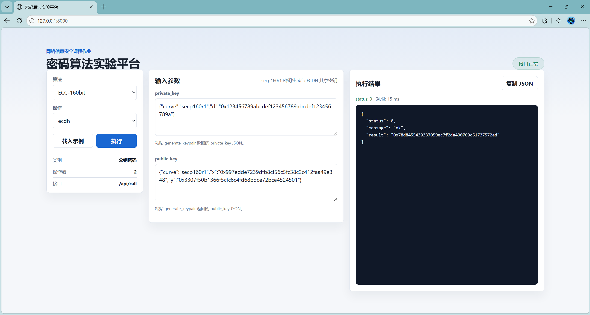

<div align="center">图 7-8 ECC-160 ECDH 共享密钥结果</div>


<div align="center">图 7-9 ECDSA 密钥生成</div>

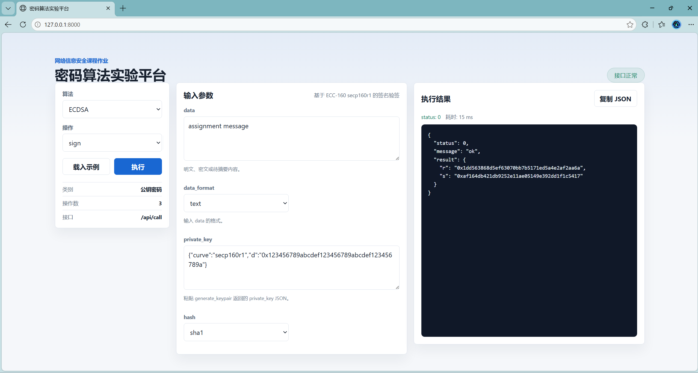

<div align="center">图 7-10 ECDSA-SHA1 签名结果</div>


<div align="center">图 7-11 ECDSA-SHA1 验签结果</div>


<div align="center">图 7-12 ECDSA-SHA256 签名结果</div>

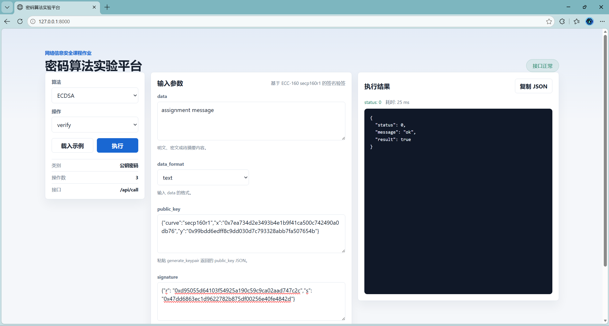

<div align="center">图 7-13 ECDSA-SHA256 验签结果</div>

<div style="page-break-after: always;"></div>

## 8. 统一接口与命令行调用

### 8.1 统一接口设计目标

作业要求系统支持第三方程序通过接口调用，并返回结果与执行状态代码。因此，本项目设计了统一入口函数 `call_algorithm`，使外部程序不需要直接了解每个算法模块的内部实现，只需要传入算法名、操作名和参数即可获得结果。

统一接口位于 `crypto_lab/api.py`：

```python
def call_algorithm(algorithm: str, operation: str, params: dict[str, Any] | None = None) -> dict[str, Any]:
    ...
```

接口参数含义如下：

| 参数 | 含义 |
| --- | --- |
| `algorithm` | 算法名称，如 `AES`、`SHA256`、`RSA` |
| `operation` | 操作名称，如 `encrypt`、`decrypt`、`digest`、`sign` |
| `params` | 参数字典，保存 data、key、iv、格式、密钥对象等 |

返回值统一为字典：

```json
{
  "status": 0,
  "message": "ok",
  "result": "执行结果"
}
```

### 8.2 接口分发流程

`call_algorithm` 会对算法名进行规范化处理，将大小写、连字符和下划线差异统一。例如 `SHA-256`、`sha256`、`SHA256` 均可归一化到同一类算法。

接口分发逻辑如下：

```text
读取 algorithm、operation、params
    |
规范化算法名和操作名
    |
根据算法类别分发：
  AES/SM4/RC6 -> 对称加密处理
  SHA/HMAC/PBKDF2 -> 摘要与认证处理
  Base64/UTF-8 -> 编码处理
  RSA -> RSA 处理
  ECC/ECDSA -> 椭圆曲线处理
    |
转换输出格式
    |
返回 status/message/result
```

### 8.3 参数格式转换

密码算法经常涉及二进制数据。为了提高接口通用性，本项目允许调用者指定输入格式：

```python
def _read_bytes(params: dict[str, Any], name: str, default: Any = None) -> bytes:
    fmt = str(params.get(f"{name}_format", "text")).lower()
    if fmt == "hex":
        return hex_to_bytes(str(value))
    if fmt in {"base64", "b64"}:
        return b64_to_bytes(str(value))
    return to_bytes(value)
```

例如 AES 密钥通常使用十六进制输入：

```json
{
  "key": "00112233445566778899aabbccddeeff",
  "key_format": "hex"
}
```

密文也可以使用十六进制或 Base64 表示，避免二进制数据在命令行或网页中显示乱码。

### 8.4 错误处理与状态码

统一接口使用 `try...except` 捕获算法模块抛出的异常。若算法执行成功，返回 `status = 0`；若发生参数错误、格式错误、密钥长度错误、解密填充错误等问题，返回 `status = 1` 并在 `message` 中给出错误信息。

实现片段如下：

```python
try:
    result = ...
    return {"status": STATUS_OK, "message": "ok", "result": result}
except Exception as exc:
    return {"status": STATUS_ERROR, "message": str(exc), "result": None}
```

这种设计使第三方程序可以根据状态码判断调用是否成功，而不必直接处理 Python 异常。

### 8.5 命令行工具设计

项目提供 `crypto_cli.py` 作为命令行调用入口。命令行工具基于 Python 标准库 `argparse` 实现，支持算法名、操作名、输入数据、密钥、IV、输入格式和输出格式等参数。

命令行调用 SHA256：

```powershell
python crypto_cli.py SHA256 digest --data abc
```

命令行调用 AES 加密：

```powershell
python crypto_cli.py AES encrypt --data "北邮信息安全" --key 00112233445566778899aabbccddeeff --key-format hex
```

命令行通过 JSON 请求调用：

```powershell
python crypto_cli.py --json "{\"algorithm\":\"SHA1\",\"operation\":\"digest\",\"params\":{\"data\":\"abc\"}}"
```

### 8.6 第三方程序调用示例

任意 Python 程序均可导入 `call_algorithm`：

```python
from crypto_lab.api import call_algorithm

resp = call_algorithm("SHA256", "digest", {"data": "abc"})
print(resp["status"])
print(resp["result"])
```

输出：

```text
0
ba7816bf8f01cfea414140de5dae2223b00361a396177a9cb410ff61f20015ad
```

第三方程序也可以调用 AES：

```python
resp = call_algorithm(
    "AES",
    "encrypt",
    {
        "data": "hello",
        "key": "00112233445566778899aabbccddeeff",
        "key_format": "hex",
        "output_format": "hex"
    }
)
```


<div style="page-break-after: always;"></div>

## 9. Web 前端展示设计

### 9.1 前端设计目标

本项目实现了一个本地 Web 前端展示页面。用户可以在浏览器中选择算法、选择操作、填写参数、载入示例，并查看统一接口返回的 JSON 结果。报告中的主要运行截图均来自该前端页面。

前端相关文件如下：

| 文件 | 功能 |
| --- | --- |
| `web/index.html` | 页面结构 |
| `web/styles.css` | 页面样式 |
| `web/app.js` | 算法配置、动态表单、请求调用和结果展示 |
| `web_server.py` | 静态文件服务与 `/api/call` 接口 |

### 9.2 页面功能

Web 页面主要功能如下：

1. 算法下拉选择，覆盖 AES、SM4、RC6、SHA、HMAC、PBKDF2、Base64、UTF-8、RSA-1024bit、ECC-160bit、RSA-SHA1、ECDSA。
2. 根据算法自动切换可用操作，如 `encrypt`、`decrypt`、`digest`、`sign`、`verify`。
3. 根据操作动态生成输入表单，如 data、key、iv、private_key、public_key 等。
4. 提供“载入示例”按钮，快速填入可运行参数。
5. 点击“执行”后向 `/api/call` 发送 JSON 请求。
6. 在页面右侧展示状态码、耗时和完整 JSON 返回结果。
7. 提供复制 JSON 按钮，便于将结果粘贴到报告中。

### 9.3 Web 服务设计

`web_server.py` 使用 Python 标准库 `ThreadingHTTPServer` 实现，无需安装额外依赖。服务提供两个能力：

1. `GET /`：返回前端页面。
2. `POST /api/call`：接收 JSON 请求，调用 `crypto_lab.api.call_algorithm` 并返回 JSON 结果。

核心处理逻辑如下：

```python
def do_POST(self) -> None:
    if self.path.split("?", 1)[0] != "/api/call":
        self._send_json(404, {"status": 1, "message": "not found", "result": None})
        return
    length = int(self.headers.get("Content-Length", "0"))
    body = self.rfile.read(length).decode("utf-8")
    request = json.loads(body)
    response = call_algorithm(request["algorithm"], request["operation"], request.get("params", {}))
    self._send_json(200, response)
```

### 9.4 前后端交互格式

前端向后端发送请求：

```json
{
  "algorithm": "SHA256",
  "operation": "digest",
  "params": {
    "data": "abc"
  }
}
```

后端返回结果：

```json
{
  "status": 0,
  "message": "ok",
  "result": "ba7816bf8f01cfea414140de5dae2223b00361a396177a9cb410ff61f20015ad"
}
```


<div style="page-break-after: always;"></div>

## 10. 执行结果与测试

### 10.1 测试方法

为了验证各算法实现正确性，本项目提供 `tests.py` 自动化测试脚本。测试内容覆盖：

1. AES-128 标准测试向量。
2. SM4 标准测试向量。
3. RC6 加密解密往返测试。
4. 统一接口 AES 加密解密测试。
5. SHA1 与 SHA256 标准摘要测试。
6. Base64 与 UTF-8 编码测试。
7. RSA-1024 加解密测试。
8. RSA-SHA1 签名验签测试。
9. ECDSA secp160r1 签名验签测试。
10. ECC-160 ECDH 共享密钥一致性测试。

执行命令：

```powershell
python tests.py
```

### 10.2 测试输出

实际测试输出如下：

```text
[OK] AES-128 block encrypt vector
[OK] AES-128 block decrypt vector
[OK] SM4 block encrypt vector
[OK] SM4 block decrypt vector
[OK] RC6 block round trip
[OK] Unified API AES encrypt
[OK] Unified API AES decrypt
[OK] SHA1
[OK] SHA256
[OK] Base64 encode
[OK] UTF-8 encode
[OK] RSA-1024 encrypt/decrypt
[OK] RSA-SHA1 sign/verify
[OK] ECDSA secp160r1 sign/verify
[OK] ECC-160 ECDH shared secret
All checks passed.
```

测试结果表明，项目中主要算法和统一接口均能正常执行。

### 10.3 编译检查

除功能测试外，项目还通过 Python 编译检查，确认源码不存在语法错误。

执行命令：

```powershell
python -m compileall crypto_lab crypto_cli.py tests.py web_server.py
```

编译检查通过，说明各 Python 模块语法正确，可以被解释器正常加载。

### 10.4 关键测试用例表

| 测试项 | 输入 | 期望结果 | 实际状态 |
| --- | --- | --- | --- |
| AES-128 加密 | 标准明文和密钥 | `69c4e0d86a7b0430d8cdb78070b4c55a` | 通过 |
| AES-128 解密 | 标准密文和密钥 | 还原标准明文 | 通过 |
| SM4 加密 | 标准明文和密钥 | `681edf34d206965e86b3e94f536e4246` | 通过 |
| SM4 解密 | 标准密文和密钥 | 还原标准明文 | 通过 |
| RC6 | 全零分组和密钥 | 解密后等于原明文 | 通过 |
| SHA1 | `abc` | `a9993e...d89d` | 通过 |
| SHA256 | `abc` | `ba7816...15ad` | 通过 |
| Base64 | `hello` | `aGVsbG8=` | 通过 |
| UTF-8 | `密码` | `e5af86e7a081` | 通过 |
| RSA-1024 | `assignment message` | 加解密一致 | 通过 |
| RSA-SHA1 | `assignment message` | 验签成功 | 通过 |
| ECDSA | `assignment message` | 验签成功 | 通过 |
| ECDH | Alice/Bob 密钥对 | 共享秘密一致 | 通过 |


<div style="page-break-after: always;"></div>

## 11. 接口调用测试

### 11.1 Python 接口调用

第三方 Python 程序可以直接调用统一接口：

```python
from crypto_lab.api import call_algorithm

resp = call_algorithm("SHA256", "digest", {"data": "abc"})
print(resp)
```

输出：

```json
{
  "status": 0,
  "message": "ok",
  "result": "ba7816bf8f01cfea414140de5dae2223b00361a396177a9cb410ff61f20015ad"
}
```

### 11.2 HTTP 接口调用

启动 Web 服务：

```powershell
python web_server.py --port 8000
```

HTTP 请求地址：

```text
http://127.0.0.1:8000/api/call
```

请求体：

```json
{
  "algorithm": "SHA256",
  "operation": "digest",
  "params": {
    "data": "abc"
  }
}
```

返回体：

```json
{
  "status": 0,
  "message": "ok",
  "result": "ba7816bf8f01cfea414140de5dae2223b00361a396177a9cb410ff61f20015ad"
}
```

### 11.3 PowerShell 接口调用示例

使用 PowerShell 调用 HTTP 接口：

```powershell
$body = @{
  algorithm = "SHA256"
  operation = "digest"
  params = @{ data = "abc" }
} | ConvertTo-Json -Depth 5

Invoke-RestMethod -Method Post -Uri http://127.0.0.1:8000/api/call -ContentType "application/json" -Body $body
```

该方式证明系统不仅能从自身 CLI 调用，也可以被第三方 HTTP 客户端调用。

### 11.4 接口状态码测试

正常请求返回：

```json
{
  "status": 0,
  "message": "ok",
  "result": "..."
}
```

错误请求示例：

```json
{
  "algorithm": "AES",
  "operation": "encrypt",
  "params": {
    "data": "abc",
    "key": "short"
  }
}
```

由于 AES 密钥长度不符合 16 字节要求，接口返回：

```json
{
  "status": 1,
  "message": "AES implementation supports 128-bit keys",
  "result": null
}
```

这说明接口能够将底层错误转换为统一状态码与错误信息，便于第三方程序判断执行状态。


<div style="page-break-after: always;"></div>

## 12. 实验总结

### 12.1 完成情况

本实验实现了可见、可测、可接口调用的展示系统。具体完成情况如下：

| 类别 | 要求算法 | 完成情况 |
| --- | --- | --- |
| 对称加密 | AES、SM4、RC6 | 已完成 |
| 哈希算法 | SHA1、SHA256、SHA3、RIPEMD160 | 已完成 |
| 消息认证与密钥派生 | HMAC-SHA1、HMAC-SHA256、PBKDF2 | 已完成 |
| 编码算法 | Base64、UTF-8 | 已完成 |
| 公钥密码 | RSA-1024、ECC-160、RSA-SHA1、ECDSA | 已完成 |
| 可见可测 | CLI、测试脚本、Web 前端 | 已完成 |
| 接口调用 | Python 接口、HTTP 接口、状态码 | 已完成 |

### 12.2 实验收获

通过本次实验，我对分组密码、哈希函数、公钥密码和数字签名的实现流程有了更具体的理解。AES 与 SM4 的实现加深了我对 S 盒、轮函数、密钥扩展和工作模式的认识；RC6 的实现让我理解了循环移位、模加和整数乘法在分组密码中的作用；RSA 的实现涉及大素数生成、模逆、模幂运算和填充机制；ECC 与 ECDSA 的实现则帮助我梳理了椭圆曲线点运算、标量乘法和签名验证流程。

同时，统一接口、命令行工具和 Web 前端使算法实现可以直接运行和验证。接口返回状态码的设计便于第三方程序判断执行结果，前端页面也让输入参数和输出结果更容易检查。


<div style="page-break-after: always;"></div>

## 13. 参考文献

[1] National Institute of Standards and Technology. FIPS PUB 197: Advanced Encryption Standard (AES). 2001.

[2] 国家密码管理局. GM/T 0002-2012 SM4 分组密码算法. 2012.

[3] Rivest R. L., Robshaw M. J. B., Sidney R., Yin Y. L. The RC6 Block Cipher. 1998.

[4] National Institute of Standards and Technology. FIPS PUB 180-4: Secure Hash Standard (SHS). 2015.

[5] National Institute of Standards and Technology. FIPS PUB 202: SHA-3 Standard: Permutation-Based Hash and Extendable-Output Functions. 2015.

[6] Krawczyk H., Bellare M., Canetti R. RFC 2104: HMAC: Keyed-Hashing for Message Authentication. 1997.

[7] Moriarty K., Kaliski B., Jonsson J., Rusch A. RFC 8018: PKCS #5: Password-Based Cryptography Specification Version 2.1. 2017.

[8] Rivest R., Shamir A., Adleman L. A Method for Obtaining Digital Signatures and Public-Key Cryptosystems. Communications of the ACM, 1978.

[9] SEC 2: Recommended Elliptic Curve Domain Parameters. Certicom Research, 2010.

[10] Johnson D., Menezes A., Vanstone S. The Elliptic Curve Digital Signature Algorithm (ECDSA). International Journal of Information Security, 2001.

[11] Python Software Foundation. Python Standard Library Documentation: argparse, http.server.


